# OpenStack Deployment With Kolla Ansible | High Availability

<p align="center">
  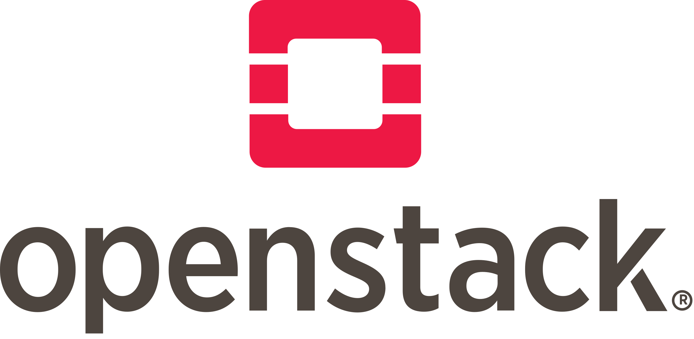
</p>

This project documents the complete process of deploying a highly available (HA) OpenStack cloud environment using **Kolla-Ansible**. The deployment includes:

- Multi-node setup (controller, compute, and storage nodes)
- Full containerization using **Docker**
- **Galera cluster**, **HAProxy**, and **Keepalived** for HA
- Centralized configuration using **Ansible**
- Virtual machines provisioned with **KVM/QEMU**

The guide is designed to help DevOps engineers, cloud architects, and advanced system administrators replicate the deployment in a lab or production-ready setup.

**Tested Environment:**  
> 🖥️ OS: Rocky Linux 9  
> ☁️ Cloud Stack: OpenStack `2024.2`  
> ⚙️ Tools: Kolla-Ansible, Docker, Ansible

> 📘 **Note:** This documentation assumes a basic understanding of Linux, networking, and Ansible.

---

## 🧱 Environment Overview

- The deployment was performed in a virtualized lab using VMWare Workstation. 
- One base virtual machine (VM) was created and then cloned to spawn additional nodes with the appropriate roles assigned.
- All VMs run **Rocky Linux 9.4** and share the same hardware specs initially, with modifications based on the role.

> 📥 **Download Rocky Linux 9.4 ISO**:  
> [https://rockylinux.org/download](https://rockylinux.org/download)
---

## 🧩 Roles of Each Node in the OpenStack Deployment

This section describes the specific responsibilities and key services hosted on each node type within the HA OpenStack cluster.


### 🧠 Controller Node

**Primary Role:**  
The "brain" of the OpenStack cluster.

**Key Services:**
- `Keystone`: Identity management
- `Glance`: Image storage for VMs
- `Nova API`: Compute API endpoints
- `Horizon`: Web dashboard interface
- `MariaDB/Galera`: Highly available database cluster
- `RabbitMQ`: Message queuing between OpenStack services

**Responsibility:**  
Handles orchestration, authentication, database operations, and API endpoints for all OpenStack components.

---

### 🧮 Compute Node

**Primary Role:**  
Runs virtual machines (VMs) and provides compute resources.

**Key Services:**
- `Nova Compute`: Manages VM lifecycle (create, delete, migrate, etc.)
- `Libvirt/KVM`: Hypervisor interface to run VMs

**Responsibility:**  
Provides vCPUs, RAM, and local storage for VMs. Compute nodes scale horizontally — adding more nodes increases cluster capacity.

---

### 🌐 Network Node

**Primary Role:**  
Manages all networking components of the OpenStack environment.

**Key Services:**
- `Neutron`: Networking service (routers, subnets, floating IPs)
- `L3 Agent`: Routing and NAT for VM networks
- `DHCP Agent`: Dynamic IP assignment to VMs
- `OVS` / `LinuxBridge`: Virtual switch to connect instances

**Responsibility:**  
Ensures full VM connectivity, external access, router/NAT functionality, and applies security group rules.

---

### 💾 Storage Node

**Primary Role:**  
Provides persistent storage to VMs (and optionally object storage).

**Key Services:**
- `Cinder Volume`: Block storage for VMs using LVM as the backend
- *(Optional)* `Swift`: Object storage (not enabled in this deployment)

**Responsibility:**  
Manages volumes, snapshots, and backups. In our setup, LVM aggregates additional disks into a single volume group (`cinder-volumes`) for dynamic block provisioning.


---

## 🖥️ Deployment Architecture

This section outlines the architecture of the OpenStack HA deployment, including the roles assigned to each node, their hardware specifications, and how they are organized to ensure scalability, high availability, and separation of concerns.


| Hostname     | Role                 | IPv4            | vCPU | RAM (GB) | Storage (GB)  | Notes                       |
|--------------|----------------------|-----------------|------|----------|---------------|-----------------------------|
| controller01 | Controller Node      | 192.168.142.141 | 2    | 8        | 40            | Also used to deploy Kolla   |
| controller02 | Controller Node      | 192.168.142.142 | 2    | 8        | 40            |                             |
| controller03 | Controller Node      | 192.168.142.143 | 2    | 8        | 40            |                             |
| compute01    | Compute Node         | 192.168.142.151 | 2    | 8        | 40            | Virtualization enabled      |
| compute02    | Compute Node         | 192.168.142.152 | 2    | 8        | 40            | Virtualization enabled      |
| network01    | Network Node         | 192.168.142.161 | 2    | 8        | 40            |                             |
| network02    | Network Node         | 192.168.142.162 | 2    | 8        | 40            |                             |
| storage01    | Storage (Cinder LVM) | 192.168.142.171 | 2    | 8        | 40 (+10 GB)   | LVM volume for Cinder       |
| storage02    | Storage (Cinder LVM) | 192.168.142.172 | 2    | 8        | 40 (+10 GB)   | LVM volume for Cinder       |

> 📌 **Note:** Each VM was cloned from `controller01` and then customized (hostname, static IP, NICs, etc.).

---

## 🔧 VM Networking

Each VM includes at least two network interfaces:

- `ens160`: Internal/OpenStack management network
- `ens192`: External network for floating IPs and external access

NIC names may vary depending on the hypervisor configuration.

> ⚠️ **Reminder:** Always confirm NIC names using `ip a` after VM creation.


## ⚙️ VM Creation and OS Configuration

This section covers the step-by-step creation of the base Rocky Linux VM, cloning it to form the OpenStack cluster, OS preparation, static IP setup, and SSH key configuration.


### 🖥️ Creating and Installing Base Rocky Linux VM

1. **Create a virtual machine** named `controller01` which will serve as the base image.  
   It will be cloned later to create other nodes, and each clone will be customized.
2. Create the VM using the previously specified hardware (e.g., 2 vCPUs, 8 GB RAM, 40 GB disk).

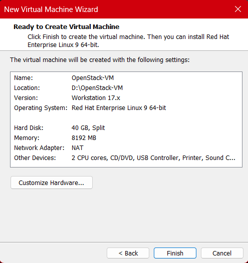

3. **Add another NIC** to the VM to support internal and external network separation.

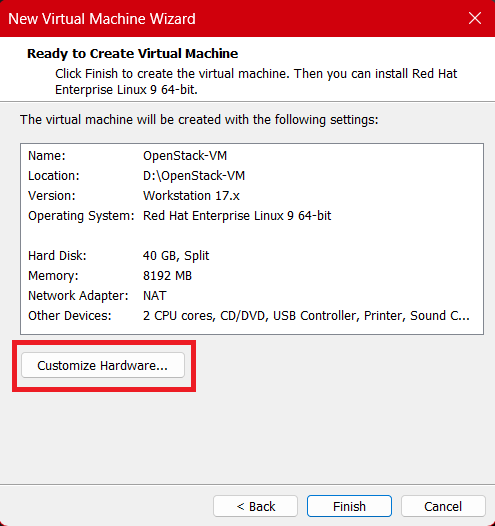

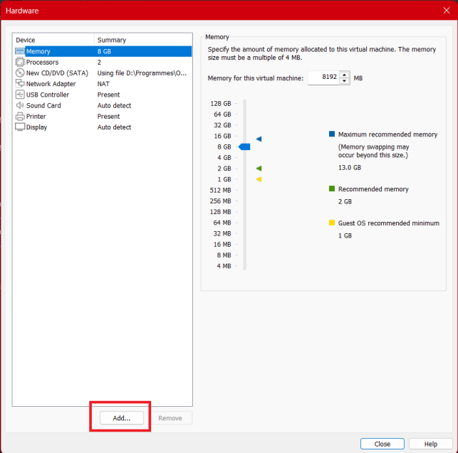

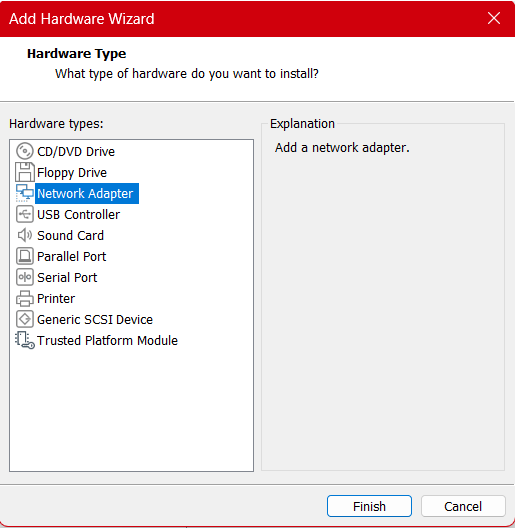

4. Confirm the final specifications before finishing the setup.

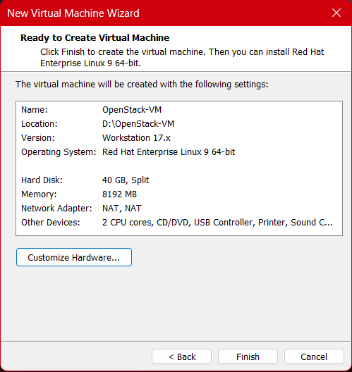

5. Start the VM and begin installing **Rocky Linux 9.4**.

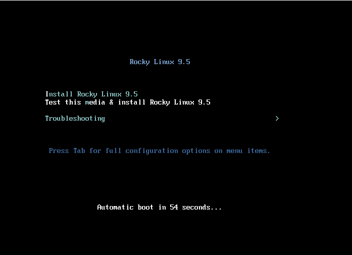

6. Choose your preferred installation language.

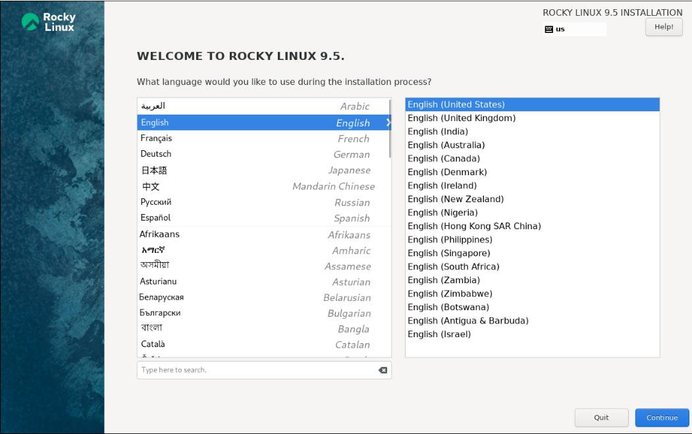

7. Configure installation settings:
   - Partitioning
   - Networking
   - Time zone
   - User creation

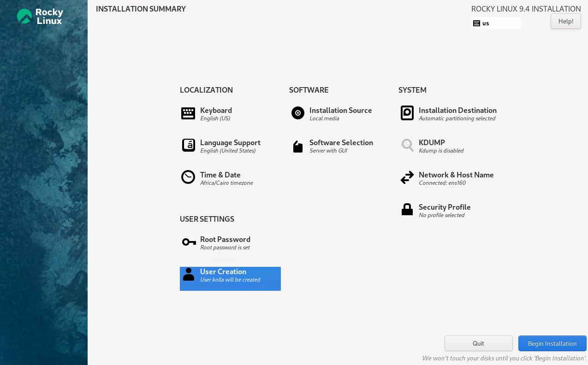

8. **Create a user named `kolla`** to be used for Kolla Ansible deployment.


9.  **Network Configuration:**
   - Keep **DHCP enabled** on the first NIC (we’ll assign a static IP later).
   - **Disable IPv4** on the second NIC (e.g., `ens192`).

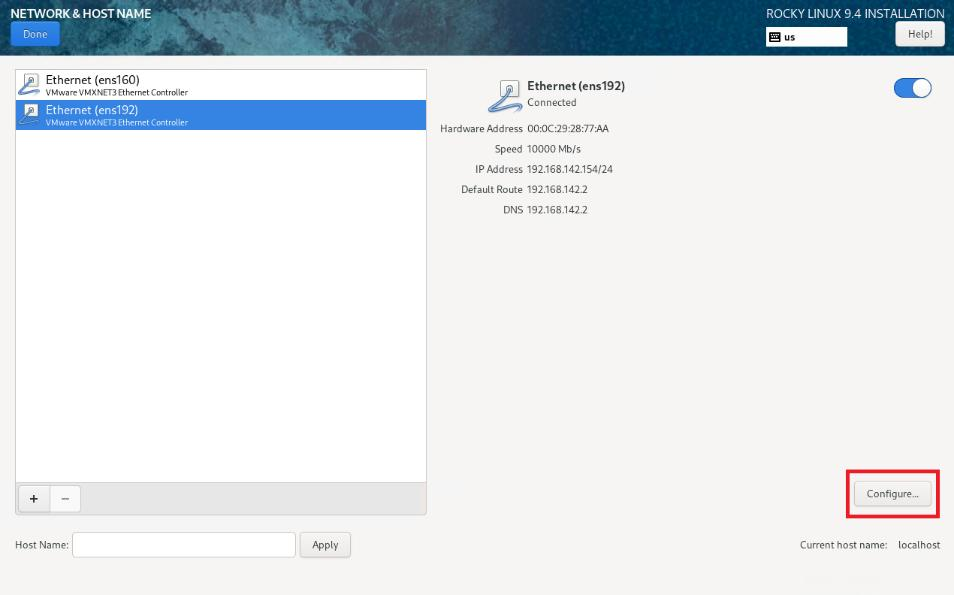

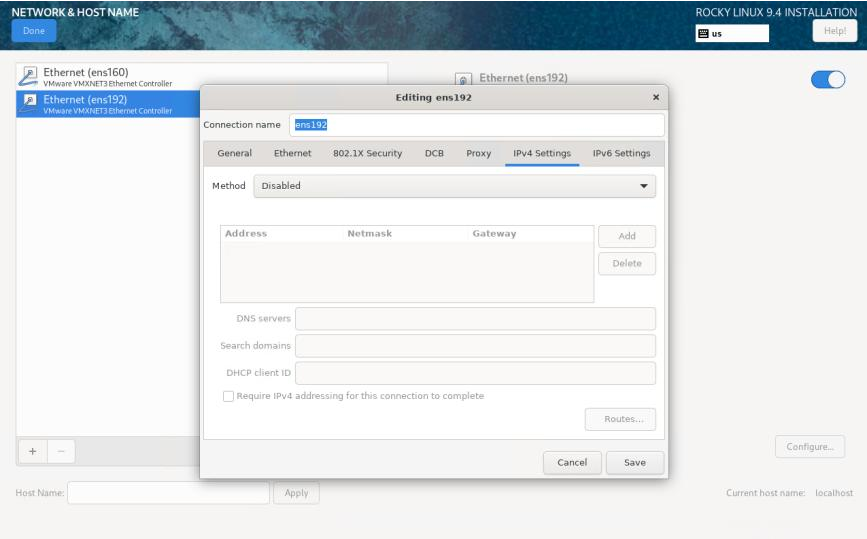

   - Disable → Enable the NIC to apply settings.


10.  Finish configuration and begin the OS installation.

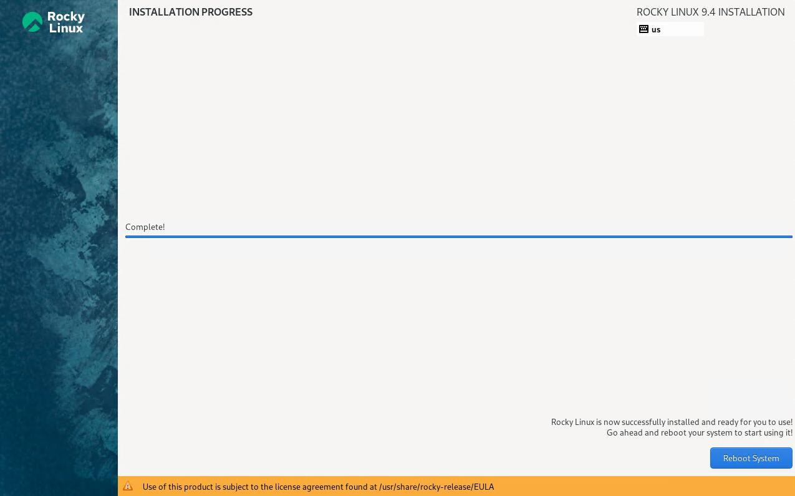

11.  After reboot, log in as `root` and update the system: 
   ```bash
   sudo dnf update -y
   ```

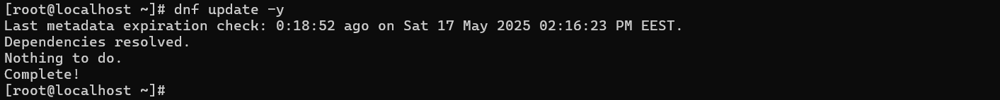

12.  Add the `kolla` user to the `wheel` group:
   ```bash
   usermod -aG wheel kolla
   grep wheel /etc/group
   ```

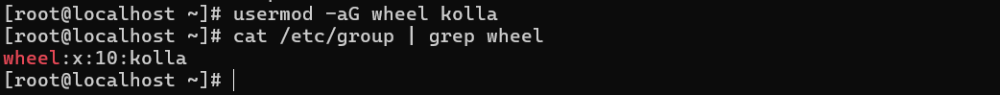

13.  Edit the sudoers file to allow passwordless sudo for the `wheel` group:
    
   ```bash
   visudo
   ```
    
   - Find:
   
   ```bash
   %wheel  ALL=(ALL)       ALL
   ```
   
   - Comment that line and uncomment:
   ```bash
   %wheel  ALL=(ALL)       NOPASSWD: ALL
   ```

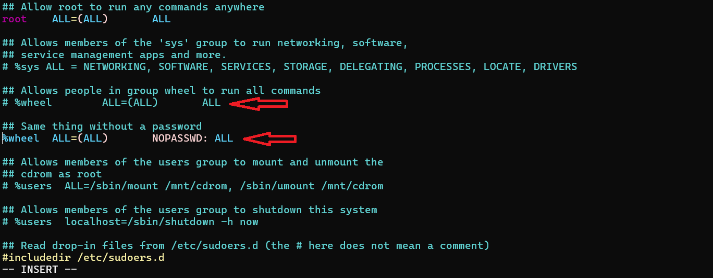

---

### 📦 Cloning the Base VM

1. Shut down the base VM (`controller01`) before cloning.
2. Use **full independent clone** option.


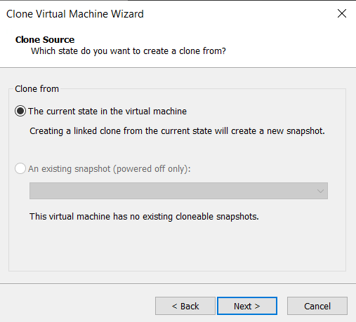


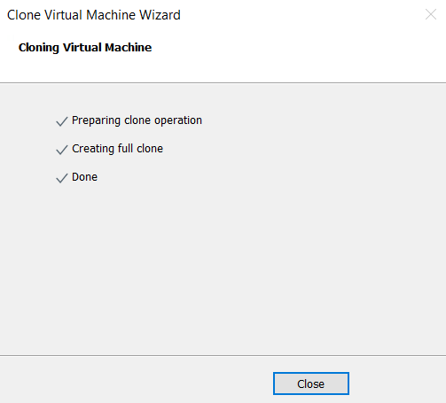

3. Repeat the process to create the full architecture:
   - `controller02`, `controller03`, `compute01`, `compute02`, `network01`, `network02`, `storage01`, `storage02`.

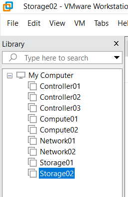

---

### 🧾 Configure Hostname and Static IP for All VMs

Each VM needs a **unique hostname** and **static IP**.

1. Set the hostname:
    ```bash
    sudo hostnamectl set-hostname <hostname>
    ```
2. Validate:
    ```bash
    hostname
    ```

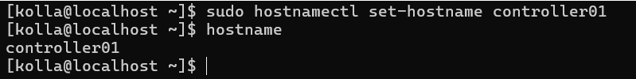

3. Set static IP for `ens160`:
    ```bash
    nmcli device status
    ```

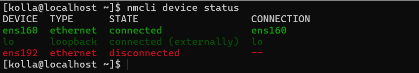

  ```bash
  sudo nmcli con mod ens160 ipv4.addresses 192.168.142.141/24
  sudo nmcli con mod ens160 ipv4.gateway 192.168.142.2
  sudo nmcli con mod ens160 ipv4.dns 192.168.142.2
  sudo nmcli con mod ens160 ipv4.method manual
  ```


  ```bash
  sudo nmcli con down ens160 && sudo nmcli con up ens160
  ip a show ens160
  ```

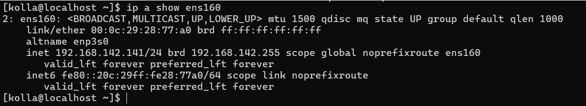

Repeat for each VM with appropriate IP and hostname.

---

### 📁 Configure `/etc/hosts` on `controller01`

- This node will act as the Kolla-Ansible deployment host. 
- This file ensures all nodes in the cluster can be referenced by hostname during the Kolla Ansible deployment.
- DNS entries in other nodes will be taken care by Ansible.


1. Open the hosts file:
    ```bash
    sudo nano /etc/hosts
    ```


2. Add these entries:
    ```text
    192.168.142.141 controller01
    192.168.142.142 controller02
    192.168.142.143 controller03
    192.168.142.151 compute01
    192.168.142.152 compute02
    192.168.142.161 network01
    192.168.142.162 network02
    192.168.142.171 storage01
    192.168.142.172 storage02
    ```

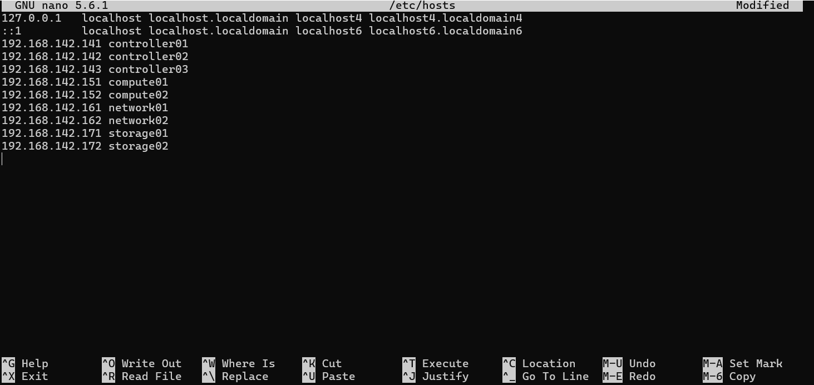

3. Test reachability:
    ```bash
    for host in controller01 controller02 controller03 compute01 compute02 network01 network02 storage01 storage02; do
      ping -c 1 $host >/dev/null && echo "$host is reachable" || echo "$host is NOT reachable"
    done
    ```

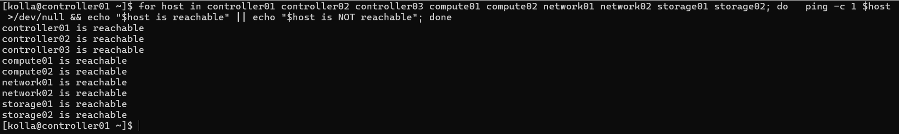

---

### 🧬 Enable Virtualization on Compute VMs

1. Open VM settings for each **compute node**.


2. Enable virtualization in the hardware settings.

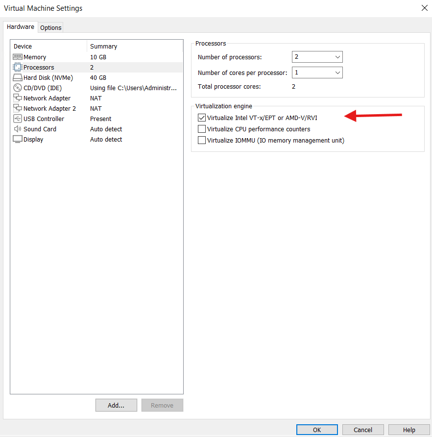

3. Repeat for `compute02`.

---

### 💽 Attach New Disk to Storage VMs (for Cinder LVM)

1. Add a new virtual disk (20GB or more) to each **storage node**.

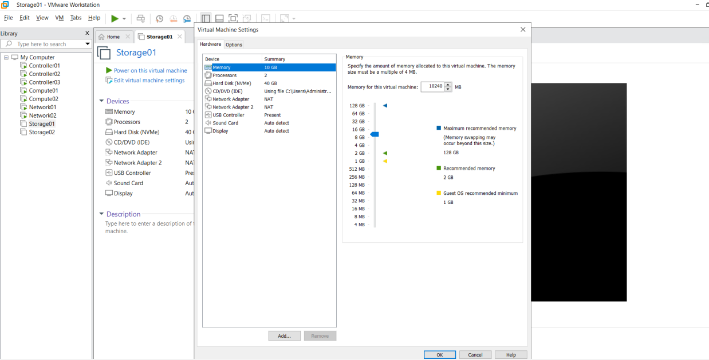

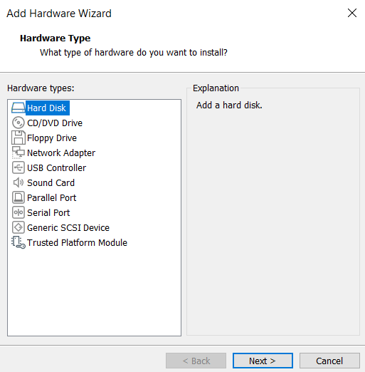

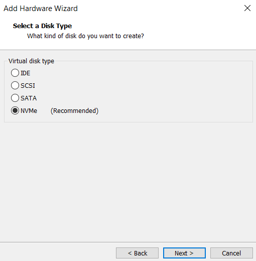

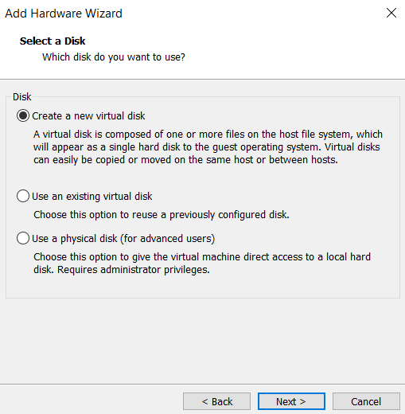

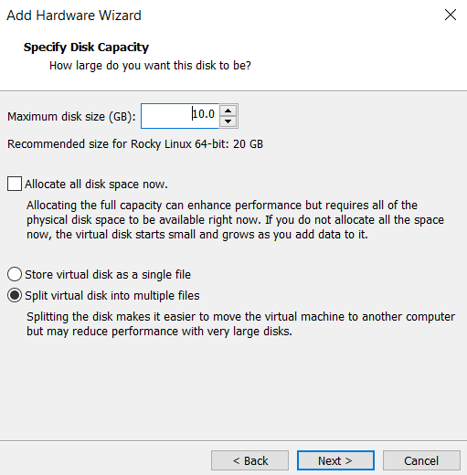

2. Verify:
    ```bash
    lsblk
    ```

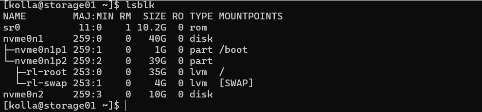

3. Initialize and configure LVM:
    ```bash
    sudo pvcreate /dev/nvme0n2
    sudo vgcreate cinder-volumes /dev/nvme0n2
    sudo vgs
    ```

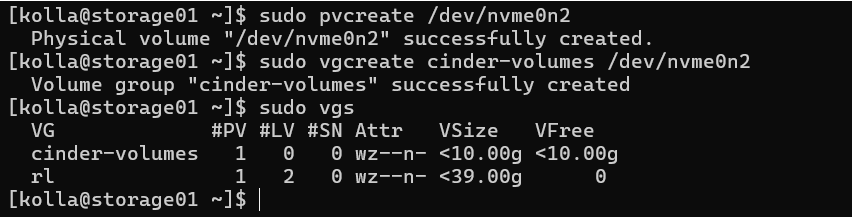

4. Repeat on `storage02`.

---

### 🔐 Generate SSH Keys for `kolla` User

Now, we will generate an SSH key for the `kolla` user on `controller01` and copy the public key to all other nodes under the same user (`kolla`). This is essential for password less SSH access, which Kolla Ansible uses to operate on remote nodes.


1. Log in as `kolla` on `controller01`.

2. Generate key pair:
    ```bash
    ssh-keygen -t rsa -b 4096 -N "" -f ~/.ssh/id_rsa
    ```

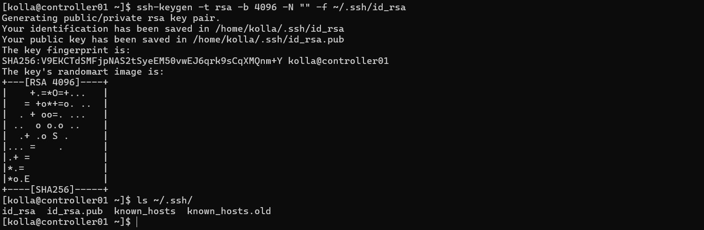

3. Copy public key to all nodes:
    ```bash
    for host in controller01 controller02 controller03 compute01 compute02 network01 network02 storage01 storage02; do
      ssh-copy-id kolla@$host
    done
    ```

> 📌 You’ll be prompted for the `kolla` user password on each host.

4. Test:
    ```bash
    ssh kolla@controller03
    ```

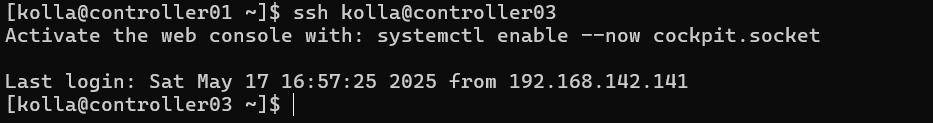

---

## 🚀 Installing OpenStack with Kolla-Ansible

All the following steps are executed on the **deployment node** (`controller01`), which orchestrates the entire OpenStack environment using **Kolla Ansible**.

---

### 📦 Install Dependencies

1. **Update system packages:**

   ```bash
   sudo dnf update -y
   ```

2. **Install Python build dependencies:**

   ```bash
   sudo dnf install git python3-devel libffi-devel gcc openssl-devel python3-libselinux -y
   ```

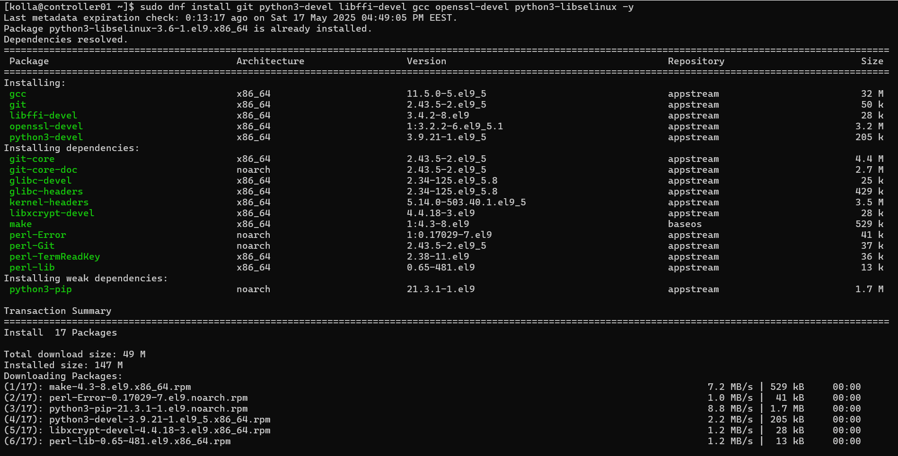

3. **Install Ansible:**

   ```bash
   sudo pip3 install ansible-core
   ```

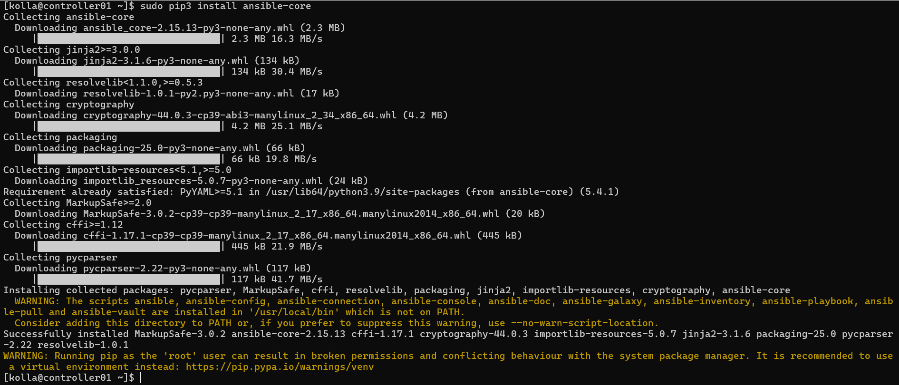

   > ⚠️ If you face a `PATH` warning, update your shell configuration:

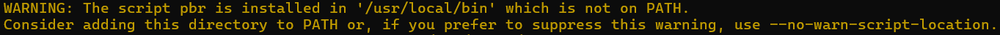

   ```bash
   nano ~/.bashrc
   # Add this line
   export PATH="/usr/local/bin:$PATH"
   source ~/.bashrc
   ```

---

### 🧰 Install Kolla Ansible

1. **Install `kolla-ansible` via pip:**

   ```bash
   sudo pip3 install kolla-ansible
   ```

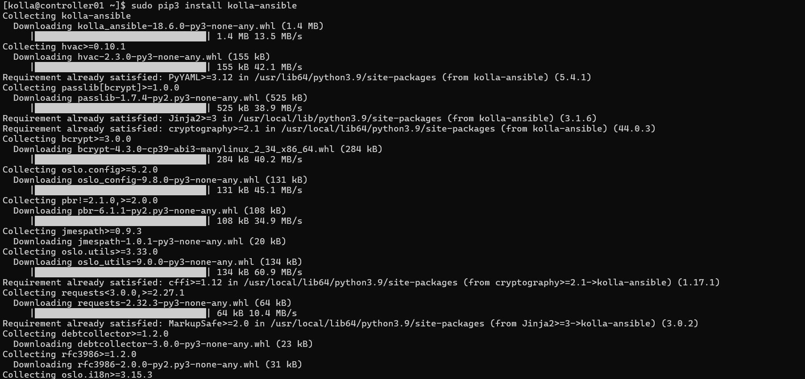

2. **Create the configuration directory:**

   ```bash
   sudo mkdir -p /etc/kolla
   sudo chown $USER:$USER /etc/kolla
   ```


3. **Copy example config files:**

   ```bash
   cp -r /usr/local/share/kolla-ansible/etc_examples/kolla/* /etc/kolla/
   ```


4. **Copy the multinode inventory file to the current directory:**

   ```bash
   cp /usr/local/share/kolla-ansible/ansible/inventory/multinode .
   ```

   > ℹ️ We're using **multinode** to deploy a highly available OpenStack setup across multiple nodes.


5. **Install Ansible Galaxy dependencies:**

   ```bash
   kolla-ansible install-deps
   ```

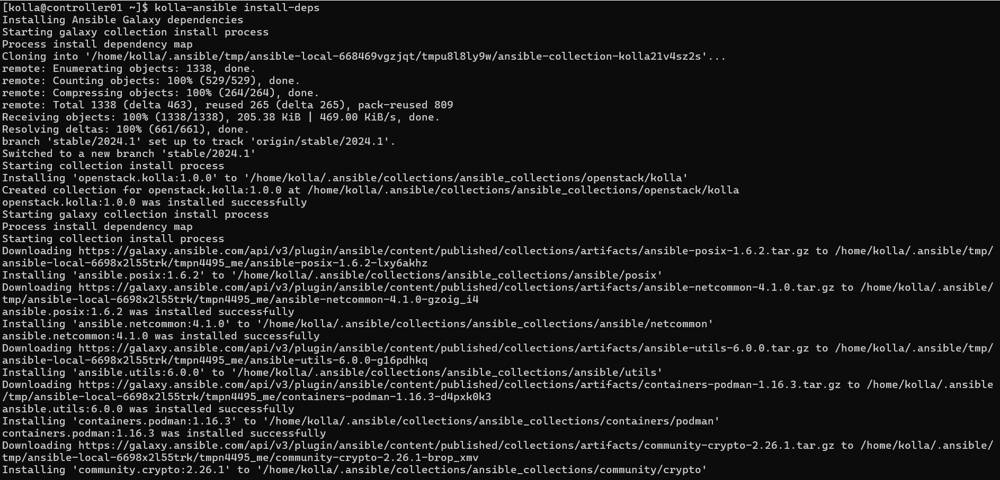

---

### ⚙️ Configure Main Files

#### `globals.yml`

* **Path:** `/etc/kolla/globals.yml`
* **Purpose:** Main config file for customizing OpenStack deployment.

```bash
nano /etc/kolla/globals.yml
```

Paste the following configuration:

<details>
<summary>🔽 Click to Expand `globals.yml` Example</summary>

```yaml
##########################
# General Configuration
##########################
config_strategy: "COPY_ALWAYS"
kolla_base_distro: "rocky"
openstack_release: "2024.2"
network_address_family: "ipv4"
kolla_container_engine: docker
docker_configure_for_zun: "yes"
containerd_configure_for_zun: "yes"
docker_apt_package_pin: "5:20.*"

##########################
# Network Configuration
##########################
network_interface: "ens160"
neutron_external_interface: "ens192"
kolla_internal_vip_address: "192.168.142.250"

##########################
# OpenStack Core Services
##########################
enable_openstack_core: "yes"
enable_keystone: "{{ enable_openstack_core | bool }}"
enable_glance: "{{ enable_openstack_core | bool }}"
enable_nova: "{{ enable_openstack_core | bool }}"
enable_neutron: "{{ enable_openstack_core | bool }}"
enable_heat: "{{ enable_openstack_core | bool }}"
enable_horizon: "{{ enable_openstack_core | bool }}"

##########################
# Networking Plugin
##########################
neutron_plugin_agent: "openvswitch"
enable_kuryr: "yes"

##########################
# High Availability
##########################
enable_haproxy: "yes"
enable_keepalived: "{{ enable_haproxy | bool }}"

##########################
# Database & Messaging
##########################
enable_mariadb: "yes"
enable_memcached: "yes"
enable_etcd: "yes"

##########################
# Telemetry & Monitoring
##########################
enable_ceilometer: "yes"
enable_aodh: "yes"
enable_gnocchi: "yes"
enable_gnocchi_statsd: "yes"
enable_prometheus: "yes"
enable_grafana: "yes"

##########################
# Block Storage (Cinder)
##########################
enable_cinder: "yes"
enable_cinder_backend_lvm: "yes"
cinder_volume_group: "cinder-volumes"

##########################
# Containerized Application Services
##########################
enable_zun: "yes"
enable_horizon_zun: "{{ enable_zun | bool }}"

##########################
# Image Service Configuration (Glance)
##########################
glance_backend_file: "yes"
glance_file_datadir_volume: "/mnt/glance"
```

</details>

---

#### `passwords.yml`

* **Path:** `/etc/kolla/passwords.yml`
* **Purpose:** Stores auto-generated or custom passwords for all OpenStack services.
* **Generate it with:**

  ```bash
  kolla-genpwd
  ```


---

#### `multinode` Inventory File

* Defines node roles and groups for the Ansible deployment.

```ini
[control]
controller01
controller02
controller03

[network]
network01
network02

[compute]
compute01
compute02

[monitoring]
controller01

[storage]
storage01
storage02

[all:vars]
ansible_user=kolla
ansible_become=True

[deployment]
localhost ansible_connection=local
```

---

### 📤 Deploy OpenStack

1. **Bootstrap the servers:**

   ```bash
   kolla-ansible bootstrap-servers -i ./multinode
   ```

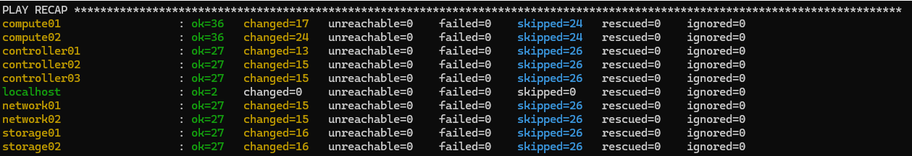

2. **Run pre-deployment checks:**

   ```bash
   kolla-ansible prechecks -i ./multinode
   ```

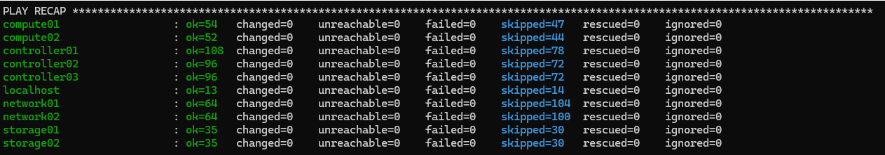

3. **Deploy OpenStack:**

   ```bash
   kolla-ansible deploy -i ./multinode
   ```

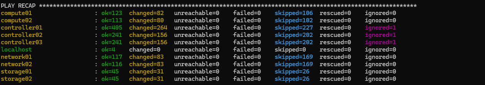

4. **Validate service configurations:**

   ```bash
   kolla-ansible validate-config -i ./multinode
   ```

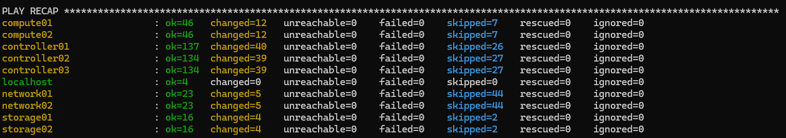

---

### 🧪 Using OpenStack After Deployment

1. **Post-deployment config (generates `clouds.yaml`):**

   ```bash
   kolla-ansible post-deploy
   ```

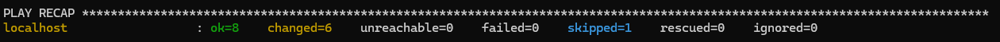

2. **Verify clouds.yaml file:**

   ```bash
   ls /etc/kolla/clouds.yaml
   ```


3. **Install OpenStack CLI:**

   ```bash
   pip install python-openstackclient -c https://releases.openstack.org/constraints/upper/master
   ```

4. **Test the deployment:**

- Try to list the services:

```bash
openstack service list
```


- Source OpenStack admin credentials file (`admin-openrc.sh`) that allows you to interact with the OpenStack CLI

```bash
source /etc/kolla/admin-openrc.sh
```

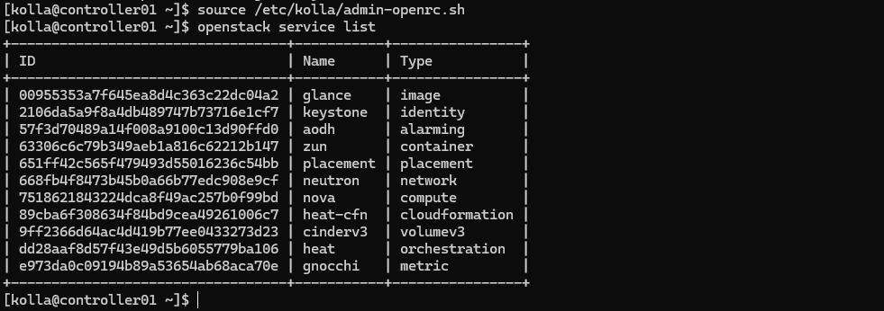

- Check the status of compute nodes:

```bash
openstack compute service list
```

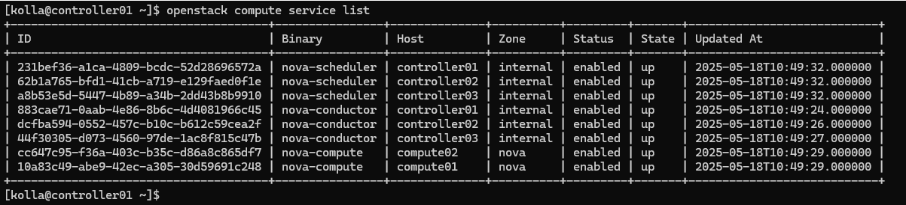

5. **Access Horizon Dashboard:**
   Open your browser and visit:
   `http://192.168.142.250`

   Login credentials:

   * **Username:** `admin`
   * **Password:** (find it using)

     ```bash
     grep keystone_admin_password /etc/kolla/passwords.yml
     ```

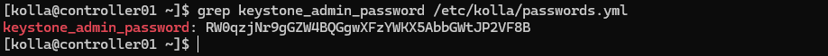

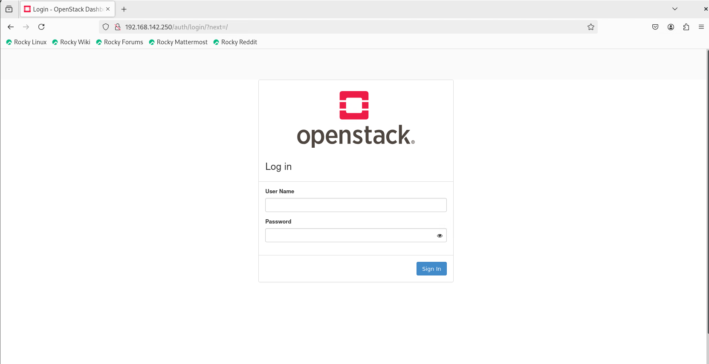

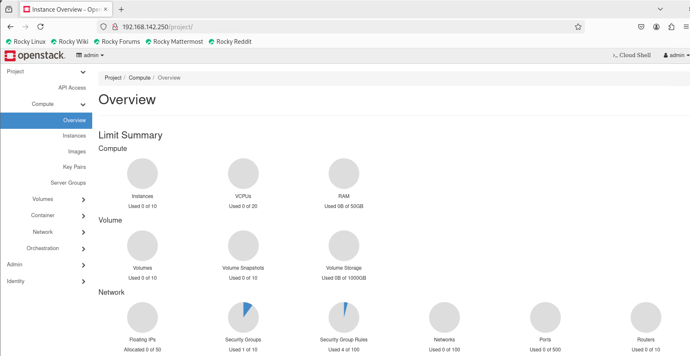

---

### 🧪 (Optional) Setup Demo Environment

```bash
/usr/local/share/kolla-ansible/init-runonce
```

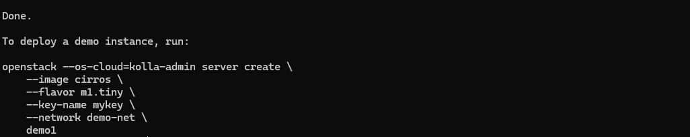

---

### 🖧 Explore Running Services on Nodes

Example Services by Role:

#### Storage Node (`storage02`)

* `cinder_backup`, `cinder_volume`, `iscsid`
* `prometheus_cadvisor`, `fluentd`

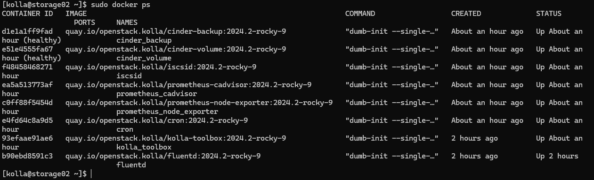

#### Network Node (`network01`)

* `neutron_l3_agent`, `neutron_dhcp_agent`, `neutron_openvswitch_agent`
* `keepalived`, `haproxy`

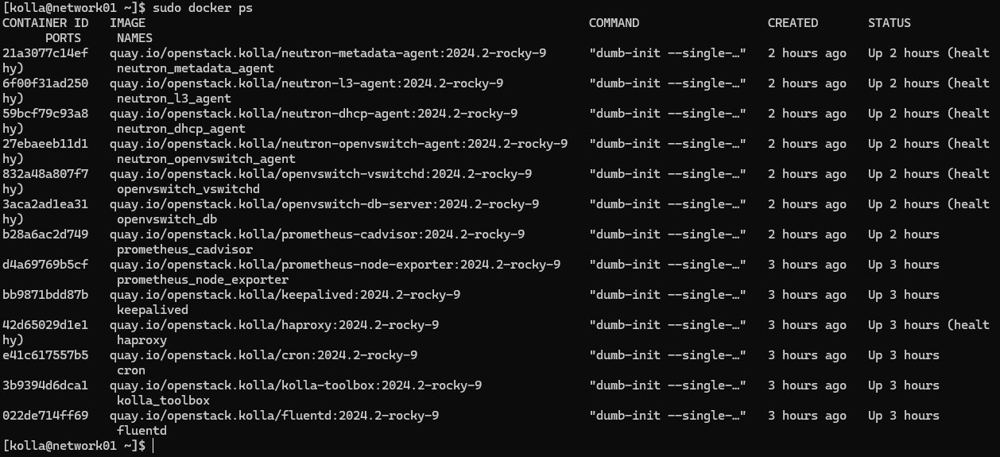

## ✅ Conclusion

This project demonstrates a full deployment of a highly available OpenStack cloud using **Kolla-Ansible** and **Docker** containers across multiple virtualized nodes. The setup includes key OpenStack services distributed among controller, compute, network, and storage nodes, all integrated with high availability components like **Galera**, **HAProxy**, and **Keepalived**.

By following this guide, system administrators and DevOps engineers can:
- Understand the architecture of a production-grade OpenStack environment
- Reproduce a working HA deployment for testing, learning, or production use
- Customize the setup further to include services like Swift, Ceilometer, or Barbican

> 🚀 **Next Steps:**  
> Consider integrating monitoring tools (Prometheus/Grafana), backups, and automation scripts to manage and scale the cloud environment more efficiently.
